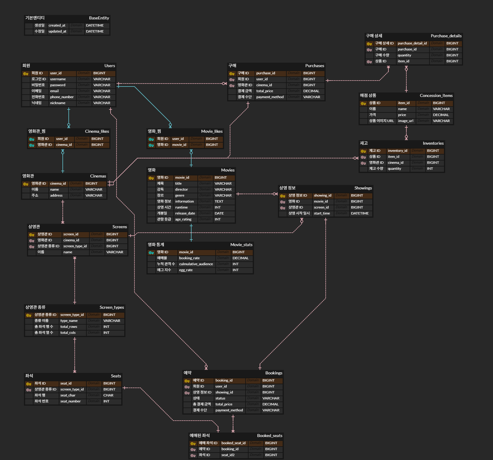

# spring-cgv-22nd
CEOS 22기 백엔드 스터디 - CGV 클론 코딩 프로젝트

# DB 모델링
## 1. 요구사항 분석하기 & 엔티티 정의하기

---

### ❕CGV 클론코딩 프로젝트❕

**구현 기능**

1. 영화관 조회
2. 영화관 찜
3. 영화 조회
4. 영화 예매, 취소
5. 영화 찜
6. 매점 구매 (환불X)
- 기타 기능 설명
    - 모든 영화관에 특별관과 일반관이 존재해요
    - 특별관, 일반관 종류가 같다면 좌석은 동일해요
    - 좌석은 직사각형 형태로 존재해요 (중간에 비어있는 곳 없음, 통로 고려X)
    - 모든 매점 메뉴는 재고가 존재해요 (추후 과제를 위해 꼭 추가해주세요!)
    - 모든 영화관의 매점 메뉴는 같아요

---

.png)

- **회원 엔티티**
    - 회원 ID (PK)
    - 아이디
    - 비밀번호
    - 전화번호
    - 이메일
    - 닉네임
- **Base Entity**
    - 생성일
    - 수정일

  “모든 엔티티가 이를 상속받음 ⇒ 중복 코드 제거”

1. **영화관 조회 (CGV 찾기)**
2. **영화관 찜 (즐겨찾기 버튼)**

.png)

- **영화관 엔티티**
    - 영화관 ID (PK)
    - 이름
    - 지역
    - 주소
- **영화관_찜 엔티티**
    - 회원 ID (FK)
    - 영화관 ID (FK)
- **상영관 엔티티**
    - 상영관 ID (PK)
    - 영화관 ID (FK)
    - 상영관 이름
    - 상영관 종류(특별관/일반관)

3. **영화 조회(CGV 차트)**

4. **영화 찜 (즐겨찾기 버튼)**

.png)

- **영화 엔티티 (고정 정보)**
    - 영화 ID (PK)
    - 제목
    - 개봉일
    - 상영 시간
    - 장르
    - 감독
    - 영화 정보
    - 관람 등급
- **영화_통계 (변하는 정보 - UPDATE 되는 정보 분리)**
    - 영화 ID (PK)
    - 예매율
    - 누적 관객 수
    - 에그 지수
- **영화_찜 엔티티**
    - 회원 ID (FK)
    - 영화 ID (FK)
- **상영_정보**

  (처음엔 놓쳤었는데 실제 상영이 되는 정보 필요)

    - 상영_정보 ID (PK)
    - 상영할 영화 ID (FK)
    - 상영할 상영관 ID (FK)
    - ~~상영 일시~~
    - 상영 시작 시간
    - ~~상영 종료 시간~~ (영화 테이블의 상영 시간 속성을 이용해서 계산)

5. **영화 예매, 취소**

- 특별관, 일반관 종류가 같다면 좌석은 동일해요
- 좌석은 직사각형 형태로 존재해요 (중간에 비어있는 곳 없음, 통로 고려X)

.png)

.png)

- **상영관_종류 엔티티 (좌석 엔티티와 분리해서 종류에 따라 한번만 저장)**
    - 상영관_종류 ID (PK)
    - 종류 이름
    - 좌석 총 행 수
    - 좌석 총 열 수
- **좌석 엔티티**
    - 좌석 ID (PK)
    - 상영관 종류 (FK)
    - 좌석 행
    - 좌석 번호
- **예약 엔티티**
    - 예약 ID (PK)
    - 회원 ID (FK)
    - 상영 정보 ID (FK)
    - ~~예매 일시~~ (BaseEntity의 생성 일시로 대체)
    - ~~예매한 좌석~~ (한 사람이 여러 좌석을 예매할 수 있기 때문에 예매된 좌석 테이블 필요)
    - 취소 일시
    - 상태 (BOOKED, CANCELED)
    - 결제 수단
    - 총 결제 금액
- **예매된 좌석 (추가)**
    - 예매 좌석 ID (PK)
    - 예약 ID (FK)
    - 좌석 ID (FK)

6. **매점 구매 (환불X)**

- 모든 매점 메뉴는 재고가 존재해요 (추후 과제를 위해 꼭 추가해주세요!)
- 모든 영화관의 매점 메뉴는 같아요

.png)

- **매점_상품 엔티티**
    - 상품 ID (PK)
    - 상품명
    - 가격
- **재고**
    - 재고 ID (PK)
    - 영화관 ID (FK)
    - 상품 ID (FK)
    - 수량
- **구매**
    - 구매 ID (PK)
    - 구매한 회원 ID (FK)
    - 구매한 영화관 ID (FK)
    - 구매 일시
- **구매 상세 (구매 - 매점상품의 중간 테이블)**
    - 구매 상세 ID (PK)
    - 구매 ID (FK)
    - 구매한 상품 ID (FK)
    - 구매 수량

 

### Q. 영화 - 영화 통계 분리한 이유?

### A. 성능 최적화를 위해

- **DB 잠금(Lock) 감소**: ‘예매율’처럼 매우 자주 바뀌는 정보와 ‘영화 제목’처럼 거의 바뀌지 않는 정보가 한 테이블에 있으면, UPDATE가 일어날 때마다 테이블에 잠금(Lock)이 걸려 다른 사용자가 영화 정보를 조회(SELECT)하는 속도가 느려질 수 있다.

 

---

## 2. 매핑 카디널리티 정의하기

### Identifying vs Non-Identifying 관계란?

**식별 관계 (Identifying Relationship)**

- 부모 테이블의 기본 키(PK)를 **자식 테이블의 기본 키(PK)의 일부로** 사용하는 관계
- 실선으로 표현

**비식별 관계 (Non-Identifying Relationship)**

- 부모 테이블의 기본 키(PK)를 **자식 테이블의 일반 외래 키(FK)로만** 사용하는 관계
- 점선으로 표현

⇒ 여기선 **Users-Cinema_likes, Cinemas-Cinema_likes, Users-Movie_likes, Movies-Movie_likes, Movies-Movie_stats** 만 **Identifying 관계**

 

| 관계 (1) | 관계 (N) | 관계 종류 | 설명 |
| --- | --- | --- | --- |
| Users | Cinema_Likes | 1:N	 | 한 회원은 여러 영화관을 찜할 수 있다. |
| Cinemas | Cinema_Likes | 1:N	 | 하나의 영화관은 여러 회원에게 찜을 받을 수 있다. |
| Users | Movie_Likes | 1:N	 | 한 명의 회원은 여러 영화를 찜할 수 있다. |
| Movies | Movie_Likes | 1:N	 | 하나의 영화는 여러 회원에게 찜을 받을 수 있다. |
| Users | Bookings | 1:N	 | 한 회원은 여러 번 예매할 수 있다. |
| Users | Purchases | 1:N | 한 회원은 여러 번 구매할 수 있다. |
| Cinemas | Screens | 1:N | 한 영화관은 여러 상영관을 가진다. |
| Cinemas | Inventories | 1:N | 한 영화관은 여러 상품의 재고를 가진다. |
| Screen_Types | Screens | 1:N | 한 종류의 상영관은 여러 곳에 있을 수 있다. |
| Screen_Types | Seats | 1:N | 한 종류의 상영관은 여러 좌석 정보를 가진다. |
| Movies | Movie_Stats | 1:1 | 한 영화는 하나의 통계 정보를 가진다.  |
| Movies | Showings | 1:N | 한 영화는 여러 번 상영될 수 있다. |
| Screens | Showings | 1:N | 한 상영관에서 여러 영화가 상영될 수 있다. |
| Showings | Bookings | 1:N | 한 상영 스케줄에 여러 예약이 있을 수 있다. |
| Bookings | Booked_Seats | 1:N | 한 예약에 여러 좌석이 포함될 수 있다. |
| Concession_Items | Inventories | 1:N | 한 상품은 여러 영화관에 재고가 있을 수 있다. |
| Concession_Items | Purchase_Details | 1:N | 한 상품은 여러 번 팔릴 수 있다. |
| Purchases | Purchase_Details | 1:N | 한 구매(영수증)에는 여러 상품이 포함될 수 있다. |

- `VARCHAR`는 **길이 제한이 있는 짧은 글**에, `TEXT`는 **길이 제한이 거의 없는 긴 글**에 사용
- `FLOAT`나 `DOUBLE` 같은 부동 소수점 타입은 0.1처럼 간단한 소수도 정확하게 표현하지 못하고 근사값으로 저장, `DECIMAL`은 값을 내부적으로 문자열(string)처럼 처리하여 저장하기 때문에 **계산 시 오차가 발생하지 않음**
 
---

