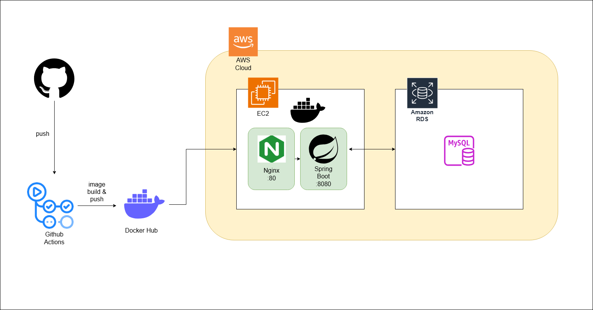
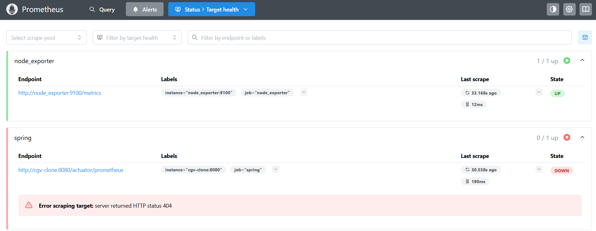

# spring-cgv-22nd
CEOS 22기 백엔드 스터디 - CGV 클론 코딩 프로젝트


# DB
모델링
## 1. 요구사항 분석하기 & 엔티티 정의하기

---

### ❕CGV 클론코딩 프로젝트❕

**구현 기능**

1. 영화관 조회
2. 영화관 찜
3. 영화 조회
4. 영화 예매, 취소
5. 영화 찜
6. 매점 구매 (환불X)
- 기타 기능 설명
    - 모든 영화관에 특별관과 일반관이 존재해요
    - 특별관, 일반관 종류가 같다면 좌석은 동일해요
    - 좌석은 직사각형 형태로 존재해요 (중간에 비어있는 곳 없음, 통로 고려X)
    - 모든 매점 메뉴는 재고가 존재해요 (추후 과제를 위해 꼭 추가해주세요!)
    - 모든 영화관의 매점 메뉴는 같아요

---

.png)

- **회원 엔티티**
    - 회원 ID (PK)
    - 아이디
    - 비밀번호
    - 전화번호
    - 이메일
    - 닉네임
- **Base Entity**
    - 생성일
    - 수정일

  “모든 엔티티가 이를 상속받음 ⇒ 중복 코드 제거”

1. **영화관 조회 (CGV 찾기)**
2. **영화관 찜 (즐겨찾기 버튼)**

.png)

- **영화관 엔티티**
    - 영화관 ID (PK)
    - 이름
    - 지역
    - 주소
- **영화관_찜 엔티티**
    - 회원 ID (FK)
    - 영화관 ID (FK)
- **상영관 엔티티**
    - 상영관 ID (PK)
    - 영화관 ID (FK)
    - 상영관 이름
    - 상영관 종류(특별관/일반관)

3. **영화 조회(CGV 차트)**

4. **영화 찜 (즐겨찾기 버튼)**

.png)

- **영화 엔티티 (고정 정보)**
  - 영화 ID (PK)
  - 제목
  - 개봉일
  - 상영 시간
  - 장르
  - 감독
  - 영화 정보
  - 관람 등급
  - 예매율
  - 누적 관객 수
  - 에그 지수
- **~~영화_통계 (변하는 정보 - UPDATE 되는 정보 분리)~~**
  - ~~영화 ID (PK)~~
  - ~~예매율~~
  - ~~누적 관객 수~~
  - ~~에그 지수~~
- **영화_찜 엔티티**
    - 회원 ID (FK)
    - 영화 ID (FK)
- **상영_정보 (스케줄)**
    - 상영_정보 ID (PK)
    - 상영할 영화 ID (FK)
    - 상영할 상영관 ID (FK)
    - ~~상영 일시~~
    - 상영 시작 시간
    - ~~상영 종료 시간~~ (영화 테이블의 상영 시간 속성을 이용해서 계산)

5. **영화 예매, 취소**

- 특별관, 일반관 종류가 같다면 좌석은 동일해요
- 좌석은 직사각형 형태로 존재해요 (중간에 비어있는 곳 없음, 통로 고려X)

.png)

.png)

- **상영관_종류 엔티티 (좌석 엔티티와 분리해서 종류에 따라 한번만 저장)**
    - 상영관_종류 ID (PK)
    - 종류 이름
    - 좌석 총 행 수
    - 좌석 총 열 수
- **좌석 엔티티**
    - 좌석 ID (PK)
    - 상영관 종류 (FK)
    - 좌석 행
    - 좌석 번호
- **예약 엔티티**
    - 예약 ID (PK)
    - 회원 ID (FK)
    - 상영 정보 ID (FK)
    - ~~예매 일시~~ (BaseEntity의 생성 일시로 대체)
    - ~~예매한 좌석~~ (한 사람이 여러 좌석을 예매할 수 있기 때문에 예매된 좌석 테이블 필요)
    - 취소 일시
    - 상태 (BOOKED, CANCELED)
    - 결제 수단
    - 총 결제 금액
- **예매된 좌석 (추가)**
    - 예매 좌석 ID (PK)
    - 예약 ID (FK)
    - 좌석 ID (FK)

6. **매점 구매 (환불X)**

- 모든 매점 메뉴는 재고가 존재해요 (추후 과제를 위해 꼭 추가해주세요!)
- 모든 영화관의 매점 메뉴는 같아요

.png)

- **매점_상품 엔티티**
    - 상품 ID (PK)
    - 상품명
    - 가격
- **재고**
    - 재고 ID (PK)
    - 영화관 ID (FK)
    - 상품 ID (FK)
    - 수량
- **구매**
    - 구매 ID (PK)
    - 구매한 회원 ID (FK)
    - 구매한 영화관 ID (FK)
    - 구매 일시
- **구매 상세 (구매 - 매점상품의 중간 테이블, 여러 상품을 동시에 구매 가능)**
    - 구매 상세 ID (PK)
    - 구매 ID (FK)
    - 구매한 상품 ID (FK)
    - 구매 수량

<br>

### ~~Q. 영화 - 영화 통계 분리한 이유?~~

### ~~A. 성능 최적화를 위해~~

~~- **~~DB 잠금(Lock) 감소**: ‘예매율’처럼 매우 자주 바뀌는 정보와 ‘영화 제목’처럼 거의 바뀌지 않는 정보가 한 테이블에 있으면, UPDATE가 일어날 때마다 테이블에 잠금(Lock)이 걸려 다른 사용자가 영화 정보를 조회(SELECT)하는 속도가 느려질 수 있다.~~~~

<br>

---

## 2. 매핑 카디널리티 정의하기

### Identifying vs Non-Identifying 관계란?

**식별 관계 (Identifying Relationship)**

- 부모 테이블의 기본 키(PK)를 **자식 테이블의 기본 키(PK)의 일부로** 사용하는 관계
- 실선으로 표현

**비식별 관계 (Non-Identifying Relationship)**

- 부모 테이블의 기본 키(PK)를 **자식 테이블의 일반 외래 키(FK)로만** 사용하는 관계
- 점선으로 표현

⇒ 여기선 **Users-Cinema_likes, Cinemas-Cinema_likes, Users-Movie_likes, Movies-Movie_likes, Movies-Movie_stats** 만 **Identifying 관계**

<br>


| 관계 (1) | 관계 (N) | 관계 종류 | 설명 |
| --- | --- | --- | --- |
| Users | Cinema_Likes | 1:N	 | 한 회원은 여러 영화관을 찜할 수 있다. |
| Cinemas | Cinema_Likes | 1:N	 | 하나의 영화관은 여러 회원에게 찜을 받을 수 있다. |
| Users | Movie_Likes | 1:N	 | 한 명의 회원은 여러 영화를 찜할 수 있다. |
| Movies | Movie_Likes | 1:N	 | 하나의 영화는 여러 회원에게 찜을 받을 수 있다. |
| Users | Bookings | 1:N	 | 한 회원은 여러 번 예매할 수 있다. |
| Users | Purchases | 1:N | 한 회원은 여러 번 구매할 수 있다. |
| Cinemas | Screens | 1:N | 한 영화관은 여러 상영관을 가진다. |
| Cinemas | Inventories | 1:N | 한 영화관은 여러 상품의 재고를 가진다. |
| Screen_Types | Screens | 1:N | 한 종류의 상영관은 여러 곳에 있을 수 있다. |
| Screen_Types | Seats | 1:N | 한 종류의 상영관은 여러 좌석 정보를 가진다. |
| Movies | Movie_Stats | 1:1 | 한 영화는 하나의 통계 정보를 가진다.  |
| Movies | Showings | 1:N | 한 영화는 여러 번 상영될 수 있다. |
| Screens | Showings | 1:N | 한 상영관에서 여러 영화가 상영될 수 있다. |
| Showings | Bookings | 1:N | 한 상영 스케줄에 여러 예약이 있을 수 있다. |
| Bookings | Booked_Seats | 1:N | 한 예약에 여러 좌석이 포함될 수 있다. |
| Concession_Items | Inventories | 1:N | 한 상품은 여러 영화관에 재고가 있을 수 있다. |
| Concession_Items | Purchase_Details | 1:N | 한 상품은 여러 번 팔릴 수 있다. |
| Purchases | Purchase_Details | 1:N | 한 구매(영수증)에는 여러 상품이 포함될 수 있다. |


- `VARCHAR`는 **길이 제한이 있는 짧은 글**에, `TEXT`는 **길이 제한이 거의 없는 긴 글**에 사용
- `FLOAT`나 `DOUBLE` 같은 부동 소수점 타입은 0.1처럼 간단한 소수도 정확하게 표현하지 못하고 근사값으로 저장, `DECIMAL`은 값을 내부적으로 문자열(string)처럼 처리하여 저장하기 때문에 **계산 시 오차가 발생하지 않음**
<br>
---


# 프로젝트 코드 작성

## 프로젝트 구조

**: 계층형 구조 (Layered Architecture)**

```java
com
└── ceos22
    └── springcgv
        ├── controller
        ├── service
        ├── repository
        └── domain 
            ├── User.java
            └── Movie.java
```

### BaseEntity

```java
@MappedSuperclass
@EntityListeners(AuditingEntityListener.class)
public abstract class BaseEntity {

    @CreatedDate // 엔티티 생성 시각을 자동 주입
    @Column(updatable = false) // 생성일은 수정되지 않도록 설정
    private LocalDateTime createdAt;

    @LastModifiedDate // 엔티티 수정 시각을 자동 주입
    private LocalDateTime updatedAt;
}

```

- @MappedSuperclass
  - 이 클래스는 다른 엔티티에게 필드를 상속해주는 역할만 한다는 것을 명시
- @EntityListeners(AuditingEntityListener.class)
  - 생성일/수정일 자동 감지 기능 활성화
- @CreatedDate
  - 엔티티 생성 시각을 자동 주입
- @LastModifiedDate
  - 엔티티 수정 시각을 자동 주입

### SpringCgvApplication

```java
@SpringBootApplication
@EnableJpaAuditing
public class SpringCgvApplication {

	public static void main(String[] args) {
		SpringApplication.run(SpringCgvApplication.class, args);
	}

}

```

- @EnableJpaAuditing
  - JPA Auditing 기능 활성화 (Audit: 감시, 검증)
  - JPA가 엔티티의 생성, 수정 시점을 감지
  - `@CreatedDate`, `@LastModifiedDate`가 붙은 필드에 현재 시간을 자동으로 주입

### User

```java
@Entity
@Getter
@NoArgsConstructor(access = AccessLevel.PROTECTED)
@Table(name = "users")
public class User extends BaseEntity {

    @Id
    @GeneratedValue(strategy = GenerationType.IDENTITY)
    @Column(name = "user_id")
    private long id;

    @Column(unique = true, nullable = false, length = 50)
    private String username;

    @Column(nullable = false)
    private String password;

    @Column(nullable = false, length = 50)
    private String name;

    @Column(unique = true, nullable = false, length = 100)
    private String email;

    @Column(name = "phone_number", length = 20)
    private String phoneNumber;

    @Column(unique = true, nullable = false, length = 50)
    private String nickname;

}

```

- @Entity
  - JPA의 엔티티임을 나타냄
- @NoArgsConstructor(access = AccessLevel.PROTECTED)
  - 파라미터가 없는 기본 생성자를 자동으로 생성
  - 생성자의 접근 수준을 protected로 지정
- @Id
  - 해당 필드가 테이블의 기본 키(Primary Key)임을 나타냄
- @GeneratedValue(strategy = GenerationType.IDENTITY)
  - 기본 키의 값을 자동으로 생성
  - 엔티티의 PK 값을 데이터베이스가 자동으로 생성하도록 위임(AUTO_INCREMENT)

### Movie

```java
@Entity
@Getter
@NoArgsConstructor(access = AccessLevel.PROTECTED)
@Table(name = "movies")
public class Movie extends BaseEntity {

    @Id
    @GeneratedValue(strategy = GenerationType.IDENTITY)
    @Column(name = "movie_id")
    private Long id;

    @Column(nullable = false)
    private String title;

    @Column(length = 100)
    private String director;

    private int runtime; // 분 단위

    @Column(name = "release_date")
    private LocalDate releaseDate;

    @Column(columnDefinition = "TEXT")
    private String description;

    @Enumerated(EnumType.STRING)
    @Column(name = "age_rating", nullable = false)
    private AgeRating ageRating;

    @Column(name = "booking_rate", precision = 4, scale = 1)
    private BigDecimal bookingRate;

    @Column(name = "cumulative_audience")
    private int cumulativeAudience;

    @Column(name = "egg_rate")
    private int eggRate;
}

```

### AgeRating

```java
public enum AgeRating {
    ALL, AGE7, AGE12, AGE15, AGE19
}
```

### MovieLike

```java
@Entity
@Getter
@NoArgsConstructor(access = AccessLevel.PROTECTED)
@Table(name = "movie_likes")
@IdClass(MovieLike.class)
public class MovieLike extends BaseEntity {

    @Id
    @ManyToOne(fetch = FetchType.LAZY)
    @JoinColumn(name = "user_id")
    private User user;

    @Id
    @ManyToOne(fetch = FetchType.LAZY)
    @JoinColumn(name = "movie_id")
    private Movie movie;
}
```

- @IdClass(MovieLikeId.class)
  - 복합키를 위한 IdClass
  - IdClass로 MovieLikeId 클래스를 사용
  - 복합 기본 키 (user_id, movie_id)
- @ManyToOne(fetch = FetchType.LAZY)
  - N : 1에서 N에 해당하는 엔티티가 1에 해당하는 엔티티와 연관 관계를 매핑할 때 사용
  - 지연 로딩

### MovieLikeId

```java
@NoArgsConstructor
@EqualsAndHashCode
public class MovieLikeId implements Serializable {
    private Long user; 
    private Long movie; 
}
```

- MovieLike 엔티티의 @Id로 선언한 필드명과 동일한 이름과 타입이어야 함


### CinemaController

```java
@RestController
@RequiredArgsConstructor
public class CinemaController {

    private final CinemaService cinemaService;

    @GetMapping("/cinemas")
    public ResponseEntity<List<CinemaDto>> getCinemasByRegion(@RequestParam String region) {
        List<CinemaDto> cinemas = cinemaService.findCinemasByRegion(region);
        return ResponseEntity.ok(cinemas);
    }
}
```

- 영화관 조회 API
- GET /cinemas
- `@RequestParam String region`: URL에 포함된 `?region=값` 형태의 쿼리 파라미터를 `region`이라는 문자열 변수에 담음
  - ex) http://localhost:8080/cinemas?region=서울

### CinemaRepository

```java
public interface CinemaRepository extends JpaRepository<Cinema, Long> {

    List<Cinema> findByRegion(String region);
}
```

- findAByB
  - 데이터를 SELECT하는 SQL 쿼리 자동 생성
- Region
  - Cinema 엔티티에 있는 region 필드를 검색 조건(WHERE)으로 사용


---

## 인증과 인가

### 인증 (Authentication)


: “누구인지 증명” → 로그인

### 인가 (Authorization)


: “접근 권한 확인하고 허가”

### 회사 비유

1. **인증 (Authentication) = 사원증 검사**
  - 출입 게이트에서 사원증을 태그
2. **인가 (Authorization) = 부서 접근 권한**
  - 5F 인사팀 / 7F 개발팀 / 10F 임원실

# 로그인 인증 방식

## 세션 기반 인증 (Stateful)

서버가 사용자의 로그인 상태 정보(세션)를 저장하고 관리하는 방식입니다.

- **동작 방식**
  1. 사용자가 로그인에 성공하면 서버는 **세션 저장소**에 사용자 정보를 저장하고, 그 저장소에 접근할 수 있는 특별한 **세션 ID**를 생성합니다.
  2. 서버는 이 세션 ID를 **쿠키**에 담아 사용자 브라우저에 보냅니다.
  3. 사용자는 이후 모든 요청에 이 세션 ID가 담긴 쿠키를 함께 보냅니다.
  4. 서버는 쿠키 속 세션 ID를 받아 세션 저장소와 대조하여 사용자를 식별합니다.
- **특징**: 서버에 사용자의 상태(State)가 저장되기 때문에 **Stateful**하다고 부릅니다.

## JWT 기반 인증 (Stateless)

서버가 사용자의 로그인 상태를 저장하지 않고, 요청에 포함된 토큰만으로 사용자를 식별하는 방식입니다. **JWT(JSON Web Token) 인증**이 가장 대표적인 예입니다.

- **동작 방식**
  1. 사용자가 로그인에 성공하면 서버는 사용자 정보와 권한, 만료 시간 등을 담은 암호화된 토큰(JWT)을 생성하여 사용자에게 전달합니다.
  2. 사용자는 이후 모든 요청의 헤더(Header)에 이 토큰을 담아 보냅니다.
  3. 서버는 토큰의 서명을 검증하여 데이터의 위변조 여부를 확인하고, 토큰 내부의 정보(Payload)를 통해 사용자를 식별합니다. 서버에 별도로 저장된 정보가 필요 없습니다.
- **특징**: 서버가 상태를 저장하지 않으므로 **Stateless**하다고 부릅니다. 확장성이 뛰어나고 모바일 앱 등 다양한 클라이언트 환경에 적용하기 좋습니다.

### 요약
| 구분 | **세션 기반 인증** | **토큰 기반 인증 (JWT)** |
| --- | --- | --- |
| **상태 저장** | 서버에 저장 (Stateful) | 서버에 저장 안 함 (Stateless) |
| **인증 정보** | 세션 ID (서버 저장소의 열쇠) | 토큰 자체 (필요 정보가 모두 담김) |
| **전달 매체** | 주로 쿠키 | 주로 HTTP 헤더 (Authorization) |
| **확장성** | 다소 불리 (서버 간 세션 공유 필요) | 유리 (토큰만 검증하면 됨) |


### Access Token (접근 토큰)

- **역할**: **실제 API 요청 권한을 증명**하는 단기 출입증입니다.
- **특징**:
  - **짧은 유효기간**: 보안을 위해 유효기간이 짧습니다. (예: 30분, 1시간)
  - **정보 포함**: 사용자 ID, 권한 등 필요한 정보를 담고 있습니다.
  - **탈취 위험**: 만약 이 토큰이 탈취되더라도, 유효기간이 짧아 피해를 최소화할 수 있습니다.
- **사용**: 사용자는 API를 요청할 때마다 이 Access Token을 헤더에 담아 보냅니다.

### Refresh Token (재발급 토큰)

- **역할**: **새로운 Access Token을 발급받기 위해** 사용하는 장기 출입증입니다.
- **특징**:
  - **긴 유효기간**: Access Token보다 훨씬 긴 유효기간을 가집니다. (예: 7일, 30일)
  - **보안된 저장**: 탈취되면 위험하므로, 서버의 안전한 DB나 클라이언트의 보안 스토리지에 저장됩니다.
  - **사용 최소화**: 실제 API 요청에는 사용되지 않고, 오직 Access Token이 만료되었을 때 **새 Access Token을 발급받는 용도**로만 사용됩니다.

### **동작 방식**

1. **최초 로그인**: 사용자가 로그인하면, 서버는 **Access Token**과 **Refresh Token**을 **모두** 발급합니다.
2. **API 요청**: 사용자는 **Access Token**을 사용하여 API를 요청합니다.
3. **Access Token 만료**: 시간이 지나 Access Token이 만료되면, API 요청이 거부됩니다.
4. **토큰 재발급**: 사용자는 가지고 있던 **Refresh Token**을 서버의 재발급 API로 보냅니다.
5. **재발급 성공**: 서버는 Refresh Token이 유효한지 확인하고, 새로운 **Access Token**을 발급해 줍니다. 사용자는 다시 로그인할 필요 없이 API 요청을 계속할 수 있습니다.

---

## 구현

### 의존성 추가

```java
	// Spring Security 0.12.16
	implementation 'io.jsonwebtoken:jjwt-api:0.12.6'
	runtimeOnly 'io.jsonwebtoken:jjwt-impl:0.12.6'
	runtimeOnly 'io.jsonwebtoken:jjwt-jackson:0.12.6'
```

### SecurityConfig

```java
@Configuration
@EnableWebSecurity
public class SecurityConfig {

  @Bean
  public BCryptPasswordEncoder passwordEncoder() {
    return new BCryptPasswordEncoder();
  }

  @Bean
  public SecurityFilterChain filterChain(HttpSecurity http) throws Exception {

    //csrf disable
    http
            .csrf((auth) -> auth.disable());

    //Form 로그인 방식 disable
    http
            .formLogin((auth) -> auth.disable());

    //http basic 인증 방식 disable
    http
            .httpBasic((auth) -> auth.disable());

    http
            .authorizeHttpRequests(auth -> auth
                    .requestMatchers("/", "/api/auth/signup", "/api/auth/login").permitAll()
                    .requestMatchers("/admin/**").hasRole("ROLE_ADMIN")
                    .anyRequest().authenticated()
            );

    //세션 설정
    http
            .sessionManagement((session) -> session
                    .sessionCreationPolicy(SessionCreationPolicy.STATELESS));

    return http.build();
  }
}

```
- `@EnableWebSecurity`
  - **SpringSecurityFilterChain 등록**: 웹 요청을 가로채 보안 처리를 담당하는 `springSecurityFilterChain`이라는 이름의 서블릿 필터(Servlet Filter)를 스프링 컨테이너에 등록
    - 서블릿 필터(Servlet Filter): 클라이언트의 요청(Request)이 서블릿(Servlet)에 도달하기 전과, 서블릿의 응답(Response)이 클라이언트에게 전달되기 전에 거치는 필터
    - 로그인 체크, 권한 검사, 요청/응답에 대한 로그 기록, Input/Output 데이터 가공, 인코딩 처리
  - 모든 요청에 대해 인증(Authentication) 요구
  - 폼 기반 로그인(Form-based Login) 및 HTTP Basic 인증 활성화
  - 세션 관리, CSRF(Cross-Site Request Forgery) 방어, 헤더 보안 설정 등
- **SpringSecurityFilterChain**
  - HTTP 요청 → 서블릿 컨테이너(WAS) → DelegatingFilterProxy →  **Security Filter Chain** (필터1 →  필터2 →  ...) →  DispatcherServlet →  컨트롤러
 


- **DelegatingFilterProxy**
  - 서블릿 컨테이너가 관리하는 **DelegatingFilterProxy** 와 스프링 컨테이너가 관리하는 **Security Filter Chain** 연결


  - 동작 원리
    1. DelegatingFilterProxy 가 Servlet Container 로 넘어온 사용자의 요청을 받음
    2. DelegatingFilterProxy 는 SpringSecurityFilterChain 이름으로 생성된 Bean 을 ApplicationContext 에서 찾음
    3. Bean 을 찾으면 SpringSecurityFilterChain 으로 요청을 위임

  ### 기본 필터의 종류와 실행 순서

  스프링 시큐리티는 기본적으로 10개 이상의 필터를 체인에 등록

  1. `SecurityContextHolderFilter`
    - 모든 요청의 시작과 끝에서 `SecurityContext`를 생성하고 정리함
    - `SecurityContextHolder`에 대한 접근을 설정하는 매우 기본적인 필터
  2. `LogoutFilter`
    - 설정된 로그아웃 URL(기본값: `/logout`)로 오는 요청을 감시하고, 해당 요청이 오면 사용자를 로그아웃 처리함
  3. `CsrfFilter`
    - CSRF 토큰을 검증하여 세션 기반의 위조 공격을 방어. (JWT 방식에서는 보통 비활성화)
  4. `UsernamePasswordAuthenticationFilter`
    - 설정된 로그인 URL(기본값: `/login`)로 오는 아이디/비밀번호 요청을 처리하여 사용자를 인증
  5. `BasicAuthenticationFilter`
    - HTTP Basic 인증 헤더가 있는지 확인하고, 있다면 인증을 처리
  6. `ExceptionTranslationFilter`
    - 필터 체인에서 발생하는 `AuthenticationException`(인증 실패)이나 `AccessDeniedException`(인가 실패)을 감지하고 처리 예를 들어, 인증되지 않은 사용자라면 로그인 페이지로 보내거나 401 오류를 반환
  7. `AuthorizationFilter`
    - `SecurityConfig`에 설정된 `authorizeHttpRequests` 규칙(`hasRole`, `permitAll` 등)을 기반으로, 사용자가 해당 요청에 접근할 권한이 있는지 최종적으로 확인(인가)

- `BCryptPasswordEncoder`
  - Spring Security가 제공하는 BCrypt 해싱 알고리즘을 Bean으로 등록

- `csrf.disable()`: 세션 기반 공격인 CSRF 공격 방어 기능을 disable.
- `formLogin.disable()`: 폼(Form) 기반의 로그인 페이지 관련 기능 disable.
- `httpBasic.disable()`: HTTP Basic 인증 방식 disable.

- `.requestMatchers("/", "/api/auth/signup", "/api/auth/login").permitAll()`
  - `"/", "/api/auth/signup", "/api/auth/login"` 경로로 들어오는 요청은 누구나 접근할 수 있도록 허용함. (인증 불필요)
  - 회원가입/로그인은 인증 전 상태에서 접근해야 함

- `.sessionCreationPolicy(SessionCreationPolicy.STATELESS)`
  - 서버가 세션을 생성하거나 사용하지 않도록 설정 (Stateless 방식)
  

### JWTUtil - JWT 발급 및 검증 클래스

```java
@Component
public class JWTUtil {

    private SecretKey secretKey;

    public JWTUtil(@Value("${spring.jwt.secret}") String secret) {
        this.secretKey = new SecretKeySpec(secret.getBytes(StandardCharsets.UTF_8), Jwts.SIG.HS256.key().build().getAlgorithm());
    }

    public String getUsername(String token) {

        return Jwts.parser().verifyWith(secretKey).build().parseSignedClaims(token).getPayload().get("username", String.class);
    }

    public String getRole(String token) {

        return Jwts.parser().verifyWith(secretKey).build().parseSignedClaims(token).getPayload().get("role", String.class);
    }

    public Boolean isExpired(String token) {

        return Jwts.parser().verifyWith(secretKey).build().parseSignedClaims(token).getPayload().getExpiration().before(new Date());
    }

    public String createJwt(String username, String role, Long expiredMs) {

        return Jwts.builder()
                .claim("username", username)
                .claim("role", role)
                .issuedAt(new Date(System.currentTimeMillis()))
                .expiration(new Date(System.currentTimeMillis() + expiredMs))
                .signWith(secretKey)
                .compact();
    }

}
```


- JWT 발급과 검증
  - 로그인 시
    - 로그인 성공 → JWT 발급
  - 접근 시
    - JWT 검증
- JWT를 암호화하고 서명하는 데 사용할 SecretKey를 생성하고 초기화
  - JWT 서명에 사용할 알고리즘을 HS256(HMAC SHA-256)으로 지정
  - secret 문자열은 application.yml 파일에 저장
- `Jwts.parser().verifyWith(secretKey).build()`
  - secretKey로 이 토큰의 서명이 유효한지 먼저 검증
  - 유효하다면 토큰에서 필요한 정보 추출
- `createJwt(String username, String role, Long expiredMs)`
  - username, role, 발행시간, 만료시간 정보를 payload에 담음
  - secretKey를 이용해 서명
  - header.payload.signature 형태의 압축된 JWT 문자열을 생성


### CustomUserDetails - UserDetails 구현체

```java
public class CustomUserDetails implements UserDetails {

    private User user;

    public CustomUserDetails(User user){
        this.user = user;
    }

    @Override
    public Collection<? extends GrantedAuthority> getAuthorities() {

        Collection<GrantedAuthority> collection = new ArrayList<>();

        collection.add(new GrantedAuthority() {
            @Override
            public String getAuthority() {

                return user.getRole().name();
            }
        });

        return collection;
    }

    @Override
    public String getPassword() {
        return user.getPassword();
    }

    @Override
    public String getUsername() {
        return user.getUsername();
    }

    @Override
    public boolean isAccountNonExpired() {
        return true;
    }

    @Override
    public boolean isAccountNonLocked() {
        return true;
    }

    @Override
    public boolean isCredentialsNonExpired() {
        return true;
    }

    @Override
    public boolean isEnabled() {
        return true;
    }
}
```

- `User` 엔티티 객체를 스프링 시큐리티가 이해할 수 있는 `UserDetails` 타입으로 변환해주는 역할
- 스프링 시큐리티는 인증 과정에서 `UserDetails` 객체의 정보를 사용하여 비밀번호를 비교하고 권한을 확인함
- `public Collection<? extends GrantedAuthority> getAuthorities()`
  - 해당 유저가 가지고 있는 권한 목록을 반환
- `getPassword()`, `getUsername()`, `isAccountNonExpired()`
  - 인증 정보 제공
  - 계정 상태 정보 제공
  - UserDetails 인터페이스의 메서드 필수적으로  overriding 해야함

### CustomUserDetailsService - UserDetailsService 구현체

```java
@Service
@RequiredArgsConstructor
public class CustomUserDetailsService implements UserDetailsService {

    private final UserRepository userRepository;

    @Override
    public UserDetails loadUserByUsername(String username) throws UsernameNotFoundException {

        User userData = userRepository.findByUsername(username)
                .orElseThrow(() -> new UsernameNotFoundException("해당 유저를 찾을 수 없습니다: " + username));

        return new CustomUserDetails(userData);
    }
}
```

- 스프링 시큐리티가 사용자 인증을 할 때 필요한 유저 정보를 DB에서 조회하는 클래스
- `loadUserByUsername(String username)`
  - 스프링 시큐리티가 로그인을 시도하는 유저의 `username` 을 이 메서드로 전달
  - DB에서 유저 조회
  - `User` 엔티티 객체를 이전에 만들었던 `CustomUserDetails` 객체로 변환해서 반환

### LoginFilter - UsernamePasswordAuthenticationFilter 구현체

```java
public class LoginFilter extends UsernamePasswordAuthenticationFilter {

    private final AuthenticationManager authenticationManager;
    private final JWTUtil jwtUtil;

    public LoginFilter(AuthenticationManager authenticationManager, JWTUtil jwtUtil) {
        this.authenticationManager = authenticationManager;
        this.jwtUtil = jwtUtil;
        // 로그인 요청 URL
        setFilterProcessesUrl("/api/auth/login");
    }

    // 로그인 요청 시 호출되어 인증을 시도하는 메서드
    @Override
    public Authentication attemptAuthentication(HttpServletRequest request, HttpServletResponse response) throws AuthenticationException {
        try {
            // JSON을 LoginRequestDto 객체로 변환
            ObjectMapper objectMapper = new ObjectMapper();
            LoginRequestDto loginRequestDto = objectMapper.readValue(request.getInputStream(), LoginRequestDto.class);

            String username = loginRequestDto.getUsername();
            String password = loginRequestDto.getPassword();

            // 스프링 시큐리티에서 사용할 인증 토큰(UsernamePasswordAuthenticationToken) 생성
            UsernamePasswordAuthenticationToken authToken = new UsernamePasswordAuthenticationToken(username, password, null);

            // AuthenticationManager에게 인증을 위임
            return authenticationManager.authenticate(authToken);
        } catch (IOException e) {
            throw new RuntimeException(e);
        }
    }

    // 인증 성공 시 호출되는 메서드
    @Override
    protected void successfulAuthentication(HttpServletRequest request, HttpServletResponse response, FilterChain chain, Authentication authResult) throws IOException, ServletException {
        // CustomUserDetails를 추출
        CustomUserDetails customUserDetails = (CustomUserDetails) authResult.getPrincipal();

        // 사용자 이름과 역할을 추출
        String username = customUserDetails.getUsername();
        Collection<? extends GrantedAuthority> authorities = authResult.getAuthorities();
        Iterator<? extends GrantedAuthority> iterator = authorities.iterator();
        GrantedAuthority auth = iterator.next();
        String role = auth.getAuthority();

        long expireMs = 60 * 60 * 1000L; // 1시간
        String token = jwtUtil.createJwt(username, role, expireMs);

        response.addHeader("Authorization", "Bearer " + token); // Authorization: Bearer [토큰값]
        response.setStatus(HttpServletResponse.SC_OK); // 200 OK
    }

    // 인증 실패 시 호출되는 메서드
    @Override
    protected void unsuccessfulAuthentication(HttpServletRequest request, HttpServletResponse response, AuthenticationException failed) throws IOException, ServletException {
        response.setStatus(HttpServletResponse.SC_UNAUTHORIZED);
    }
}
```

- 사용자의 로그인 요청(`POST /login`)을 직접 처리하여 인증을 수행하고, 성공 시 JWT를 발급
- Form Login Filter를 disable 시켰기 때문에 `UsernamePasswordAuthenticationFilter` 커스텀 구현 필요
- 필터 등록

### SecurityConfig

```java
    http
            .addFilterAt(new LoginFilter(authenticationManager(authenticationConfiguration)), UsernamePasswordAuthenticationFilter.class);

```

### JWTFilter

```java
package com.ceos22.springcgv.config.jwt;

import com.ceos22.springcgv.config.CustomUserDetails;
import com.ceos22.springcgv.domain.user.User;
import jakarta.servlet.FilterChain;
import jakarta.servlet.ServletException;
import jakarta.servlet.http.HttpServletRequest;
import jakarta.servlet.http.HttpServletResponse;
import org.springframework.security.authentication.UsernamePasswordAuthenticationToken;
import org.springframework.security.core.Authentication;
import org.springframework.security.core.context.SecurityContextHolder;
import org.springframework.web.filter.OncePerRequestFilter;

import java.io.IOException;

public class JWTFilter extends OncePerRequestFilter {

    private final JWTUtil jwtUtil;

    public JWTFilter(JWTUtil jwtUtil) {
        this.jwtUtil = jwtUtil;
    }

    @Override
    protected void doFilterInternal(HttpServletRequest request, HttpServletResponse response, FilterChain filterChain) throws ServletException, IOException {

        //request에서 Authorization 헤더를 찾음
        String authorization= request.getHeader("Authorization");

        //Authorization 헤더 검증
        if (authorization == null || !authorization.startsWith("Bearer ")) {

            System.out.println("token null");
            filterChain.doFilter(request, response);

            //조건이 해당되면 메소드 종료
            return;
        }

        //Bearer 부분 제거 후 순수 토큰만 획득
        String token = authorization.split(" ")[1];

        //토큰 소멸 시간 검증
        if (jwtUtil.isExpired(token)) {

            System.out.println("token expired");
            filterChain.doFilter(request, response);

            return;
        }

        //토큰에서 username과 role 획득
        String username = jwtUtil.getUsername(token);
        String role = jwtUtil.getRole(token);

        //user를 생성하여 값 set
        User user = User.builder()
                .username(username)
                .password(null) // 임시 비밀번호
                .role(User.Role.valueOf(role))
                .build();

        //UserDetails에 회원 정보 객체 담기
        CustomUserDetails customUserDetails = new CustomUserDetails(user);

        //스프링 시큐리티 인증 토큰 생성
        Authentication authToken = new UsernamePasswordAuthenticationToken(customUserDetails, null, customUserDetails.getAuthorities());
        //세션에 사용자 등록
        SecurityContextHolder.getContext().setAuthentication(authToken);

        filterChain.doFilter(request, response);

    }
}

```

- 클라이언트가 로그인 이후에 보내는 모든 요청을 가로채서, 요청에 포함된 JWT가 유효한지 검증하는 클래스
- 요청의 `Authorization` 헤더를 확인
  - 헤더가 없거나, Bearer  로 시작하지 않으면 `doFilter(request, response)` 로 다음 체인으로 넘기고 메서드 종료
- 토큰 만료 여부 확인
- 토큰이 검증되면(JWTUtil), 토큰의 payload에 저장된 `username`과 `role` 정보를 꺼냄
- 임시 User 및 UserDetails 생성
  - 토큰에서 꺼낸 정보를 바탕으로 `UserDetails` 객체(`customUserDetails`) 생성
- `CustomUserDetails`를 사용하여 `Authentication` 객체 생성
- 이 객체를 `SecurityContextHolder`에 저장
  - `SecurityContextHolder` 에 저장된  `Authentication` 객체는 애플리케이션의 어디서든 현재 로그인한 사용자의 정보를 쉽게 꺼내 쓸 수 있음

### SecurityConfig

```java
        http
                .addFilterBefore(new JWTFilter(jwtUtil), LoginFilter.class);
```

- LoginFilter 앞에 JWTFilter 등록


---

# 동시성(Concurrency)

## 1. 동시성이란

멀티스레드 환경에서 여러 요청이 **동시에 같은 자원에 접근하거나 수정할 때 발생하는 문제**를 말함.

스프링은 `Thread-per-request` 모델로 동작하기 때문에,

여러 사용자가 동시에 같은 API를 호출하면 각 요청이 **서로 다른 스레드에서 병렬로 수행됨.**

예를 들어, 동시에 여러 사용자가 같은 매점 상품 재고를 차감하는 경우를 생각해보면

각 스레드가 같은 데이터를 읽어도 서로 다른 객체로 메모리에 존재하게 됨.

이 상태에서 동시에 `decreaseStock()` 메서드를 수행하면,

각 스레드가 DB에 서로 다른 값을 갱신하게 되어 **재고 불일치**가 발생함.

---

## 2. 동시성 문제의 원인

- 여러 스레드가 동시에 **같은 데이터를 읽고 수정**하려는 상황
- **트랜잭션 격리 수준(Isolation Level)** 만으로는 제어되지 않는 **어플리케이션 단의 경쟁 조건(Race Condition)**
- DB, JVM, 캐시 등 여러 계층에서 동시에 같은 데이터를 접근할 수 있음.

---

## 3. 동시성 문제 해결 방법

동시성 문제를 해결하기 위해 다양한 접근 방식이 존재하며,

대표적으로 **자바 레벨의 synchronized**, **데이터베이스 Lock**, **Redis 분산락** 방법이 있음.

---

### 3-1. synchronized

- **개념**
  - 자바 레벨에서 제공하는 동기화 키워드
  - 특정 메서드나 코드 블록에 한 번에 하나의 스레드만 접근하도록 제한함
  - 스레드가 해당 블록에 진입하면 **락(monitor lock)** 을 획득
  - 다른 스레드는 락이 해제될 때까지 대기함
- **원리**
  - 모든 인스턴스는 내부적으로 고유한 락(monitor)을 가지고 있으며,
  - `synchronized` 가 붙은 메서드를 호출할 때 해당 객체의 락을 획득해야만 실행할 수 있음
  - 락이 반납되기 전까지는 다른 스레드가 접근하지 못함
- **장점**
  - 구현이 간단하고 JVM 내부에서 동작하기 때문에 빠르게 적용 가능
  - 한정된 코드 블록 수준의 제어가 용이함
- **단점**
  - JVM 내부에서만 유효하므로, **분산 서버 환경에서는 무의미**
  - DB에 반영되는 시점과 동기화되지 않음
  - 락 경쟁이 심할 경우 성능 저하
- **적용 예시**

  같은 인스턴스를 여러 스레드가 공유할 때 (예: `@Service` 싱글톤 객체)

  단일 서버 환경에서 메모리 내 객체 접근을 제어할 때 사용


---

### 3-2. DB Lock

데이터베이스 수준에서 레코드에 락을 걸어

여러 트랜잭션이 동시에 동일한 데이터를 수정하지 못하도록 막는 방식

### (1) Pessimistic Lock

- **개념**
  - 데이터를 읽는 순간부터 **다른 트랜잭션이 해당 데이터를 수정하지 못하게 락을 거는 방식**
  - 즉, “충돌이 일어날 것이다”라고 가정하고 미리 락을 걺.
  - JPA에서는 `@Lock(LockModeType.PESSIMISTIC_WRITE)` 를 사용함.
- **동작 방식**

    ```sql
    SELECT * FROM inventory WHERE id = ? FOR UPDATE;
    ```

  위 쿼리처럼 `FOR UPDATE` 구문이 실행되어

  해당 행(row)을 다른 트랜잭션이 수정하려 하면 **대기 상태**에 들어감

- **장점**
  - 충돌이 일어날 가능성이 높을 때 안전함
  - 실제 수정 시점에서의 데이터 정합성을 확실히 보장함
- **단점**
  - 데드락(Deadlock) 가능성이 존재함
  - 락 대기 시간으로 인해 성능이 저하될 수 있음
- **적용 예시**

  재고 차감, 좌석 예약 등 **동시 수정이 빈번한 비즈니스 로직**에서 사용


---

### (2) Optimistic Lock

- **개념**
  - 실제 충돌이 자주 일어나지 않는다고 가정
  - 데이터에 락을 걸지 않고 업데이트 시점에 **버전(version)** 을 비교하는 방식
  - JPA에서는 엔티티에 `@Version` 필드를 추가하여 사용
- **동작 방식**
  1. 데이터를 읽을 때 버전 정보를 함께 가져옴
  2. 커밋 시점에 버전이 동일하면 업데이트하고, 다르면 `OptimisticLockException` 발생.
  3. 예외가 발생하면 애플리케이션에서 재시도 로직을 구현함
- **장점**
  - 락을 사용하지 않아 **데드락이 발생하지 않음**
  - 읽기 위주의 트랜잭션이 많은 환경에서 성능이 우수함
- **단점**
  - 충돌 발생 시 예외가 발생하고, 별도의 **재시도 로직**이 필요함
  - 업데이트 빈도가 높으면 성능이 급격히 떨어질 수 있음
- **적용 예시**

  읽기 작업이 많고, 동시에 수정될 확률이 낮은 환경


---

### (3) Named Lock

- **개념**
  - 데이터베이스에서 제공하는 **명시적 락(Explicit Lock)** 기능을 이용하는 방식
  - MySQL에서는 `GET_LOCK()` 함수를 사용하여 이름 단위로 락을 걸 수 있다.
- **특징**
  - 특정 자원(예: `snack:{cinemaId}:{itemId}`)에 이름을 부여해 락을 관리함
  - 분산 환경에서도 사용할 수 있으나, 락 획득 후 반드시 해제해야 함
- **장점**
  - 트랜잭션 범위를 벗어나서도 사용 가능
  - 자원 단위로 세밀한 락 제어 가능
- **단점**
  - 락 해제 누락 시 시스템 전체에 영향을 줄 수 있음
  - 코드 복잡도가 높아진다.
- **적용 시점**
  - 특정 데이터 집합 전체를 보호해야 하는 상황
  - DB 단에서 트랜잭션 외부 락을 관리해야 할 때

---

### 3-3. Redis Lock

Redis를 활용해 분산 환경에서도 동시성을 제어할 수 있음

DB 락은 단일 인스턴스 기준으로만 동작하지만,

Redis는 여러 서버 인스턴스가 하나의 Redis를 공유하므로 **분산 락(Distributed Lock)** 구현이 가능함

### (1) Lettuce 기반 분산락

- **개념**

  `SETNX`(Set if Not Exists) 명령을 이용하여 락을 획득함

  단일 키에 대해 동시에 여러 요청이 들어와도,

  먼저 락을 얻은 요청만이 자원에 접근할 수 있음

- **특징**
  - `SET key value NX PX timeout` 형태로 명령을 보내고,

    일정 시간이 지나면 락이 자동으로 해제됨

  - 스프링에서 기본적으로 Lettuce 클라이언트를 사용함
- **장점**
  - 구현이 간단하고 속도가 빠름
  - 자동 만료 설정으로 데드락 방지 가능.
- **단점**
  - TTL 설정 실수 시 조기 만료 가능성.
  - 락이 풀리기 전에 장애 발생 시 재진입 불가.
- **적용 시점**

  단일 자원 접근 제어, 짧은 트랜잭션에서의 간단한 분산 락


---

### (2) Redisson 기반 분산락

- **개념**

  Redis의 pub/sub 기반으로 동작하는 고수준 분산락 라이브러리.

  락 획득 및 해제 로직을 직접 구현하지 않아도 되며,

  `tryLock()` 메서드로 락 획득을 시도하고 일정 시간 후 자동 해제됨

- **특징**
  - `RLock` 인터페이스를 통해 락을 관리.
  - 자동 연장(Watchdog) 기능으로 안정적.
- **장점**
  - 분산 환경에서 신뢰성 높은 락 제공.
  - 재진입(Reentrant) 가능.
  - TTL 관리 및 장애 복구 지원.
- **단점**
  - 별도의 의존성과 Redis 설정 필요.
  - Lettuce보다 상대적으로 무거움
- **적용 시점**
  - 여러 서버 인스턴스가 동시에 공유 데이터를 수정하는 **분산 서버 환경**,
  - **멀티 인스턴스 Spring Boot 애플리케이션**

---

## 4. 정리
| 구분 | 제어 위치 | 장점 | 단점 | 주 사용 환경 |
| --- | --- | --- | --- | --- |
| synchronized | JVM 내부 | 간단한 구현 | 분산 환경 불가 | 단일 서버 |
| Pessimistic Lock | DB 트랜잭션 | 강력한 정합성 | 데드락, 지연 | 수정 많을 때 |
| Optimistic Lock | DB 트랜잭션 | 충돌 적을 때 빠름 | 예외 처리 필요 | 읽기 많을 때 |
| Named Lock | DB 단 | 명시적 락 제어 | 락 관리 복잡 | 자원 단위 제어 |
| Redis(Lettuce) | Redis 서버 | 빠르고 간단 | TTL 의존 | 단기 분산락 |
| Redis(Redisson) | Redis 서버 | 안정적, 자동 해제 | 설정 복잡 | 대규모 분산 환경 |

---

## 5. CGV 프로젝트를 위한 선택
## **Pessimistic Lock (비관적 락)**

### 선택 이유

1. **트랜잭션 단위로 DB에 직접 락을 걸 수 있습니다.**

   → 여러 사용자가 동시에 같은 `Inventory`를 수정하려고 해도

   먼저 접근한 트랜잭션이 끝날 때까지 나머지는 기다립니다.

2. **충돌이 잦은 환경(동시 주문)에 적합합니다.**

   → 낙관적 락처럼 예외가 발생하고 재시도할 필요가 없습니다.

3. **Spring Data JPA와 궁합이 좋습니다.**

   → `@Lock(LockModeType.PESSIMISTIC_WRITE)` 만 붙이면 구현 가능합니다.

---

## 외부 API 통신 방식 비교

### 1. RestTemplate
- Spring에서 가장 오래 사용된 HTTP 클라이언트
- URL, Header, Body를 코드로 직접 작성
- 장점: 단순, 설정이 쉬움
- 단점: 반복 코드 많음, 유지보수 어려움

### 2. WebClient
- RestTemplate의 후속 버전 (Spring 5 이상)
- 비동기/논블로킹 방식으로 동작
- 장점: 고성능, 병렬 처리에 강함
- 단점: 코드 복잡, 리액티브 타입(Mono/Flux) 필요

### 3. FeignClient
- 인터페이스만 정의하면 자동으로 HTTP 호출 수행
- Spring Cloud OpenFeign 라이브러리 기반
- 장점: 선언형이라 코드가 간결, 재사용성 높음
- 단점: 추가 의존성 필요, 버전 호환 이슈 있음


---

# Deploy

## Docker

### 트러블 슈팅
```jsx
2025-10-31T01:50:12.939Z INFO 1 --- [ main] com.zaxxer.hikari.HikariDataSource : HikariPool-1 - Starting... 
2025-10-31T01:50:12.946Z ERROR 1 --- [ main] j.LocalContainerEntityManagerFactoryBean : Failed to initialize JPA EntityManagerFactory: [PersistenceUnit: default] Unable to build Hibernate SessionFactory; nested exception is java.lang.RuntimeException: Driver com.mysql.cj.jdbc.Driver claims to not accept jdbcUrl, ${DB_URL}
```
- 환경 변수를 읽지 못하고 ${DB_URL} 값이 그대로 문자열로 들어오는 문제 발생

- .env 안에는 DB 비밀번호, API 키 같은 민감정보가 있음
- 이미지 안에 포함시키면 Docker Hub에서 유출될 위험이 있음
- 따라서 .env 파일은 이미지 빌드 시 포함되지 않음
- 빌드(Build) 시점에는 제외하고, 실행(Runtime) 시점에 주입하는 것이 원칙

```
docker run --env-file .env spring-app
```
- EC2에서 컨테이너 실행할 때 환경 변수 주입


### 왜 .jar 파일이 두 개 생길까? 어떤 걸 Docker build 해야 할까?


- Gradle이 jar + bootJar 둘 다 생성
- jar (일반 JAR): 순수 Java 클래스 + 리소스만 포함된 기본 JAR
  - 실행 엔트리포인트가 없음
  - SNAPSHOT-plain.jar
- bootJar (Spring Boot 실행 JAR): Spring Boot 앱을 실행할 수 있는 실행형 JAR
  - Spring Boot 실행에 필요한 모든 것 + 실행 스크립트가 포함
  - SNAPSHOT.jar

따라서 Docker에서 실행하기 위해선 bootJar인 SNAPSHOT.jar를 Docker build 해야한다.
- gradle에서 plain.jar를 생성하지 않도록 설정하기도 함

---

## Docker Compose

- 여러 컨테이너(여러 이미지 기반)를 하나의 서비스 스택으로 묶고,

- **한 명령으로 실행/중지/관리**할 수 있게 해주는 도구

### 예시
- Spring Boot Backend (컨테이너 1)
- MySQL Database (컨테이너 2)
- Redis cache (컨테이너 3)
- Nginx reverse proxy (컨테이너 4)
<br></br> 
- 각각 docker run
```
docker run ...
docker run ...
docker run ...
docker run ...
```
- docker compose 사용
```
docker compose up -d
```
### 쿠버네티스?

Docker Compose
- 한 서버 안에서 여러 컨테이너를 띄움
- ex) 웹 서버 + DB + Redis를 한 서버 내에서 실행
- 개발/소규모 서비스에 적합

Kubernetes
- 여러 서버(Worker Node)에 컨테이너를 분산해서 실행
- 중앙에 Control Plane이 있고 각 노드들을 관리
- 장애나 트래픽 증가하면:
  - 컨테이너 자동 재시작
  - 노드에 자동 분배
  - 인스턴스(컨테이너) 수 자동 확장

### EC2 내 docker-compose.yml
```
version: "3.8"

services:
app:
image: danaggero/deploy-test
container_name: cgv-clone
ports:
- "80:8080"
env_file:
- .env
restart: always
```


```jsx
2025-10-31T14:18:59.563Z ERROR 1 --- [nio-8080-exec-1] c.c.s.g.e.GlobalExceptionHandler : 예상치 못한 에러 발생: org.springframework.web.servlet.resource.NoResourceFoundException: No static resource .
```

정적 파일이 없어서 발생하는 정상적인 에러

---

## CICD

### Github Action
.github/workflows/deploy.yml
```jsx
name: CI/CD Deploy to EC2

on:
  push:
    branches: [ "develop" ]

permissions:
  contents: read

jobs:
  build:
    runs-on: ubuntu-latest
    steps:

      - name: checkout
        uses: actions/checkout@v3

      - name: Grant execute permission for gradlew
        run: chmod +x gradlew

      - name: Set up JDK 17
        uses: actions/setup-java@v3
        with:
          java-version: '17'
          distribution: 'temurin'

      - name: Build Spring Boot JAR
        run: ./gradlew bootJar


      - name: Login to DockerHub
        run: |
          echo "${{ secrets.DOCKER_PASSWORD }}" | docker login -u "${{ secrets.DOCKER_USERNAME }}" --password-stdin

      - name: Build Docker Image & Push
        run: |
          docker build -t ${{ secrets.DOCKER_USERNAME }}/spring-app .
          docker push ${{ secrets.DOCKER_USERNAME }}/spring-app

      - name: Build Nginx Image & Push
        run: |
          docker build -f nginx/Dockerfile -t ${{ secrets.DOCKER_USERNAME }}/nginx-proxy .
          docker push ${{ secrets.DOCKER_USERNAME }}/nginx-proxy


      - name: Deploy to EC2 (SSH)
        uses: appleboy/ssh-action@master
        with:
          host: ${{ secrets.EC2_HOST }}
          username: ubuntu
          key: ${{ secrets.EC2_KEY }}
          script: |
            cd /home/ubuntu/app
            sudo docker compose down || true
            sudo docker pull ${{ secrets.DOCKER_USERNAME }}/spring-app
            sudo docker pull ${{ secrets.DOCKER_USERNAME }}/nginx-proxy
            sudo docker compose up -d --force-recreate
            sudo docker system prune -f
```

## CI (Continuous Integration)
- 코드를 자동으로 빌드하고 Docker 이미지로 패키징
- Docker Hub에 push하여 배포 준비 완료
```dockerfile

      - name: Build Spring Boot JAR
        run: ./gradlew bootJar

      - name: Login to DockerHub
        run: |
          echo "${{ secrets.DOCKER_PASSWORD }}" | docker login -u "${{ secrets.DOCKER_USERNAME }}" --password-stdin

      - name: Build Docker Image & Push
        run: |
          docker build -t ${{ secrets.DOCKER_USERNAME }}/spring-app .
          docker push ${{ secrets.DOCKER_USERNAME }}/spring-app

      - name: Build Nginx Image & Push
        run: |
          docker build -f nginx/Dockerfile -t ${{ secrets.DOCKER_USERNAME }}/nginx-proxy .
          docker push ${{ secrets.DOCKER_USERNAME }}/nginx-proxy
```

파이프라인
```
Spring Boot 빌드 (bootJar)
↓
Docker 로그인
↓
Spring 이미지 build & push
↓
Nginx 이미지 build & push
```

### CD (Continuous Deployment)
- EC2에서 최신 Docker 이미지를 pull
- 컨테이너 재시작 및 배포 자동화
```dockerfile
      - name: Deploy to EC2 (SSH)
        uses: appleboy/ssh-action@master
        with:
          host: ${{ secrets.EC2_HOST }}
          username: ubuntu
          key: ${{ secrets.EC2_KEY }}
          script: |
            cd /home/ubuntu/app
            sudo docker compose down || true
            sudo docker pull ${{ secrets.DOCKER_USERNAME }}/spring-app
            sudo docker pull ${{ secrets.DOCKER_USERNAME }}/nginx-proxy
            sudo docker compose up -d --force-recreate
            sudo docker system prune -f
```
파이프라인
```
EC2 서버 접속
↓
프로젝트 디렉토리로 이동
↓
기존 컨테이너 종료 및 제거
↓
최신 Spring 이미지 pull
↓
최신 Nginx 이미지 pull
↓
컨테이너 재배포
↓
Docker 캐시 정리
```

결과


---

# CGV 서비스 아키텍처 구조도

- Grafana, Prometheus 제외
---
# 부하테스트
## Grafana & Prometheus 추가
```gradle
global:
  scrape_interval: 5s  # 5초마다 데이터 수집

scrape_configs:
  - job_name: "node_exporter"
    static_configs:
      - targets: ["node_exporter:9100"]

  - job_name: "spring"
    metrics_path: "/actuator/prometheus"
    static_configs:
      - targets: ["spring:8080"]
```
- prometheus.yml 작성

## 스크립트
```javascript
export const options = {
  stages: [
    { duration: "2m", target: 200 },
    { duration: "2m", target: 400 },
    { duration: "2m", target: 600 },
    { duration: "2m", target: 800 },
    { duration: "2m", target: 1000 },
  ],
};
```
- 총 6단계로 구성
- 각 단계마다 2분씩 virtual users 를 점진적으로 늘려가면서 테스트

### EC2 내부에서 K6 실행

- 결과


- VUS가 증가하는데 http_request가 감소하는 구간 발생
- 서버 응답 처리 속도가 점차 느려지고 있음을 시사
- 병목 구간 발생
- VU가 300까지밖에 찍히지 않음
- 그 후엔 응답 불능 상태


- CPU


- Memory
- 예상 시나리오
  - VU 상승 (요청 폭주)
  - 스레드 풀 포화 -> 대기 큐에 요청 객체 쌓임 (메모리 점유)
  - 힙 공간 부족 -> Garbage Collector로 CPU 사용
  - Full GC 발생 -> CPU 100% 점유
  - Stop-the-world (GC 동안 모든 스레드가 멈춤 -> 요청 처리 중단)
  - 모든 요청 응답 불가

### EC2와 Local 중 어디에서 script를 실행하는 것이 좋을까?
- 처음에는 별 생각 없이 "당연히 EC2에 부하가 걸리니 EC2에서 script를 실행하는 것이 좋지"라고 생각했다.
- 그런데 script를 실행하는 건 사용자이므로 Local에서 script를 실행하는 것이 더 실제와 가깝다.
```
[EC2 서버 내부]   (k6 실행)
  k6 run → localhost:8080 → Nginx → Spring → DB
```
- End-to-End 사용자 경험 테스트에 적합
```
 [로컬 PC]         [EC2 서버]
  k6 run → HTTP 요청 → Nginx → Spring → DB
```
- 서버 자체 성능 테스트에 적합

### Local에서 K6 실행

- http_req_duration
  - max=15s
- http_req_waiting
  - max=15s


- 병목 현상 발생


- 병목 현상이 발생하는 곳에 EC2 instance의 CPU 점유율이 90% 이상인 구간 발생
- CPU에 부하가 일어났음을 알 수 있다.
- Memory는 60%대로 안정적 

- Prometheus에서 spring container에 대한 부하를 탐색하고 싶었지만 하지 못하였다...



---
# 7주차

## 트랜잭션 전파(Propagation)

트랜잭션이 이미 진행 중일 때, 새로 호출된 메서드가 기존 트랜잭션에 참여할지, 새로운 트랜잭션을 생성할지를 결정하는 설정

전파는 논리 트랜잭션과 물리 트랜잭션의 처리 방식에 영향을 줌

- 물리 트랜잭션: 실제 DB Connection 단에서 커밋/롤백되는 트랜잭션
- 논리 트랜잭션: 스프링 내부에서 메서드 단위로 관리하는 트랜잭션 경계

### 원칙

- 모든 논리 트랜잭션이 커밋되어야 물리 트랜잭션이 커밋됨
- 하나라도 롤백하면 물리 트랜잭션은 롤백됨
- 신규 트랜잭션만 물리 트랜잭션을 커밋 또는 롤백할 수 있음

---

### REQUIRED (기본값)

- 트랜잭션이 있으면 기존 트랜잭션에 참여하고, 없으면 새로운 트랜잭션을 만듦

- 서비스 간 호출 시 가장 일반적으로 사용되는 방식

---

### REQUIRES_NEW

- 기존 트랜잭션이 있으면 일시 정지시키고, 항상 새로운 물리 트랜잭션을 시작함

- 로그 기록처럼, 메인 로직이 실패해도 별도로 커밋되어야 하는 경우에 사용됨

---

### SUPPORTS

- 트랜잭션이 있으면 참여하고, 없으면 트랜잭션 없이 실행함

- 트랜잭션이 반드시 필요하지 않은 조회성 메서드에 적합함

---

### MANDATORY

- 기존 트랜잭션이 반드시 존재해야 함

- 트랜잭션 없이 호출하면 예외(IllegalTransactionStateException)가 발생함

- 상위 트랜잭션 내부에서만 실행되어야 하는 경우에 사용함

---

### NOT_SUPPORTED

- 트랜잭션을 사용하지 않음

- 만약 기존 트랜잭션이 존재한다면 일시 정지시키고 non-transactional로 실행함

- 트랜잭션에 묶이면 안 되는 로직(외부 호출, 로그 저장)에 사용됨

---

### NEVER

- 트랜잭션이 존재하면 안 됨

- 트랜잭션이 있으면 예외가 발생

- 항상 트랜잭션 없이 실행되어야 하는 메서드에 사용됨

---

### NESTED

- 상위 트랜잭션 내부에서 savepoint를 생성하여 부분 롤백이 가능한 중첩 트랜잭션을 만듦

- 상위 트랜잭션은 하나의 물리 트랜잭션을 유지하지만, 내부적으로 savepoint 기반으로 논리적 분리 지점을 만듦

- 상위 트랜잭션이 롤백되면 중첩 트랜잭션도 모두 롤백되지만, 중첩 트랜잭션만 실패하면 savepoint까지만 롤백함

참고: REQUIRES_NEW는 새로운 물리 트랜잭션을 만들지만, NESTED는 같은 물리 트랜잭션 내에서 savepoint로 관리한다.

---

## Index

데이터를 빠르게 조회하기 위해 특정 컬럼을 기준으로 미리 정렬해둔 자료구조

- 일반적으로 B-Tree 기반으로 구성되며, 검색 성능을 크게 향상시킴

---

## Index 종류

### 클러스터드 인덱스 (Clustered Index)

- 테이블의 데이터 자체가 인덱스 순서대로 정렬되어 있는 구조

- MySQL(InnoDB)에서는 PK가 자동으로 클러스터드 인덱스로 사용됨

특징

- 한 테이블에 하나만 존재
- 기본 키 순서대로 실제 데이터가 저장됨
- 범위 조회에 매우 빠름
- PK 변경이 많으면 비효율적

예시

- PK(id)를 기준으로 레코드가 디스크에 물리적으로 정렬됨

---

### 보조 인덱스 (Secondary Index, Non-Clustered Index)

- 클러스터드 인덱스를 제외한 나머지 인덱스

- 실제 데이터가 아니라, 정렬된 인덱스 키와 PK 값을 저장한다.

특징

- 테이블에 여러 개 생성 가능
- 인덱스를 통해 PK로 이동한 뒤 실데이터를 읽음 (두 번 접근: 인덱스 → 테이블)
- 조회 속도는 빠르지만 쓰기 비용 증가

---

### 복합 인덱스 (Composite Index)
: 여러 개의 컬럼을 묶어서 하나의 인덱스로 만드는 방식

Ex) (title, director)

특징

- 왼쪽부터 사용해야 인덱스가 효율적으로 동작한다 (Leftmost Prefix Rule)
- WHERE 절 조건 순서가 인덱스 구성과 다르면 인덱스가 사용되지 않을 수 있음
- 데이터 중복도가 낮은 컬럼을 앞에 두는 것이 일반적으로 유리

예시

(title, director) 인덱스가 있을 경우

- title 단독 조회 → 인덱스 사용 가능
- director 단독 조회 → 사용 불가능
- title + director 조합 조회 → 사용 가능

---

### 커버링 인덱스 (Covering Index)

: 쿼리가 필요한 모든 컬럼이 인덱스에 포함되어 있어 테이블을 전혀 접근하지 않아도 되는 인덱스

Ex)

인덱스: (email, name)

쿼리:

```
SELECT name FROM users WHERE email = 'test@test.com'

```

→ 인덱스만 조회하고 테이블을 읽지 않아도 된다.

특징

- 테이블 I/O를 제거하여 매우 빠름
- 조회량 많은 대형 서비스에서 자주 활용됨

---

## 성능 최적화

- 영화 조회 API 이용
- 영화 307개 INSERT

```jsx
EXPLAIN
SELECT * FROM movies
ORDER BY booking_rate DESC
LIMIT 10;
```


- type : ALL
  - Full Table Scan 수행
- possible_keys : NULL
  - 사용할 수 있는 인덱스 없음
- key : NULL
  - 실제 사용된 인덱스 없음
- filtered = 100
  - 필터링 비율 100% 예측

```jsx
-> Limit: 10 row(s)  (cost=31.7 rows=10) (actual time=0.532..0.537 rows=10 loops=1)
    -> Sort: movies.booking_rate DESC, limit input to 10 row(s) per chunk  (cost=31.7 rows=307) (actual time=0.531..0.536 rows=10 loops=1)
        -> Table scan on movies  (cost=31.7 rows=307) (actual time=0.0286..0.359 rows=307 loops=1)

```

- actual time=0.532..0.537
  - 걸린 시간 0.537ms
- rows=10
  - 조회 예측 행 수 10개

```jsx
CREATE INDEX idx_booking_rate ON movies(booking_rate);
```

- booking_rate 단일 인덱스 적용

```jsx
-> Limit: 10 row(s)  (cost=31.7 rows=10) (actual time=0.439..0.444 rows=10 loops=1)
    -> Sort: movies.booking_rate DESC, limit input to 10 row(s) per chunk  (cost=31.7 rows=307) (actual time=0.438..0.443 rows=10 loops=1)
        -> Table scan on movies  (cost=31.7 rows=307) (actual time=0.029..0.304 rows=307 loops=1)

```

- actual time=0.439..0.444
  - 걸린 시간 0.444ms
- rows=10
  - 조회한 행 수 10개

```jsx
EXPLAIN 
SELECT * FROM movies WHERE age_rating = 'AGE19';
```


- type : ALL
  - Full Table Scan 수행
- filtered = 20
  - 필터링 비율 20% 예측


- actual time=0.027 .. 0.311
  - 걸린 시간 0.311ms
- rows=307
  - 조회한 행 수 307개 (ALL)

### 쿼리 최적화

```jsx
CREATE INDEX idx_age_rating ON movies(age_rating);
```

- index age_rating에 생성

### 결과


- type: ref
  - 동등 조건(=)을 인덱스로 조회할 때 나오는 타입
- rows=47
- filtered = 100
  - 예상 필터링 비율 100% row


- actual time=0.0258..0.144
  - 걸린 시간 0.144ms
- rows=47
  - 조회한 행 수 47개

---

```jsx
EXPLAIN 
SELECT * FROM movies 
WHERE age_rating = 'ALL' AND runtime < 120;
```


- type : ALL
  - Full Table Scan 수행
- possible_keys : NULL
  - 사용할 수 있는 인덱스 없음
- key : NULL
  - 실제 사용된 인덱스 없음
- rows=307
  - 조회 예측 행 수 307개 (ALL)
- filtered = 6.67
  - 필터링 비율 예측: 약 6.67%
- Extra = Using where
  - 필터 조건(age_rating + runtime)을 통해 추가 필터링 적용


```jsx
> Filter: ((movies.age_rating = 'ALL') and (movies.runtime < 120)) (cost=31.7 rows=20.5) (actual time=0.0348..0.323 rows=20 loops=1)
-> Table scan on movies (cost=31.7 rows=307) (actual time=0.0268..0.274 rows=307 loops=1)
```

- actual time=0.0348..0.323
- rows=307
  - 조회 예측 행 수 307개 (ALL)

```jsx
CREATE INDEX idx_movies_age_runtime
ON movies (age_rating, runtime);
```

- 복합 인덱스 적용
- (age_rating, runtime)

결과


```jsx
-> Index range scan on movies using idx_movies_age_runtime over (age_rating = 'ALL' AND runtime < 120),
 with index condition: ((movies.age_rating = 'ALL') and (movies.runtime < 120))  (cost=9.26 rows=20) (actual time=0.0355..0.12 rows=20 loops=1)

```

- actual time=0.0355..0.12
- rows=20

---

